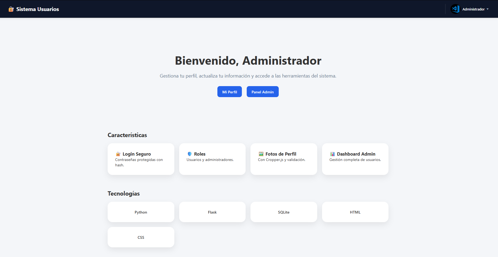
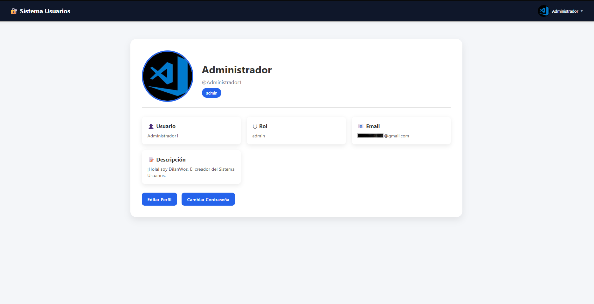
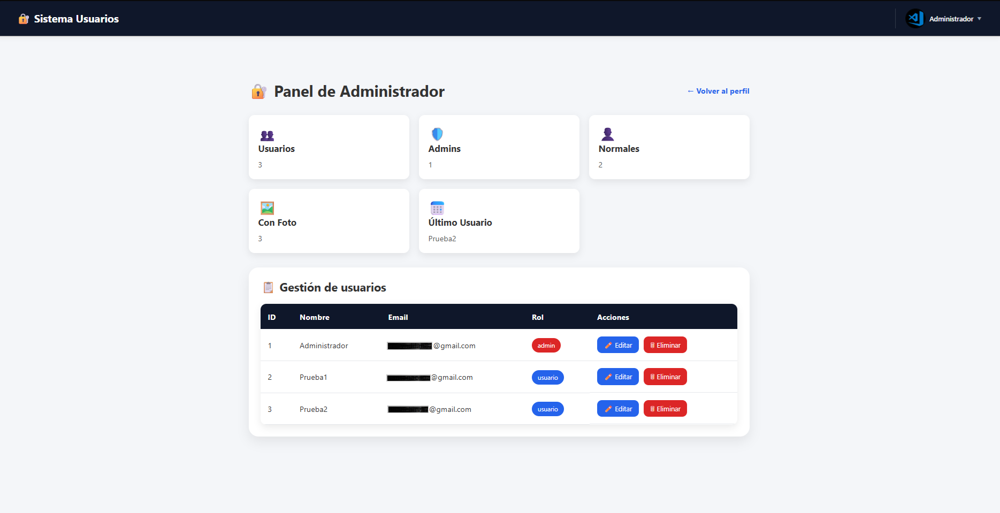
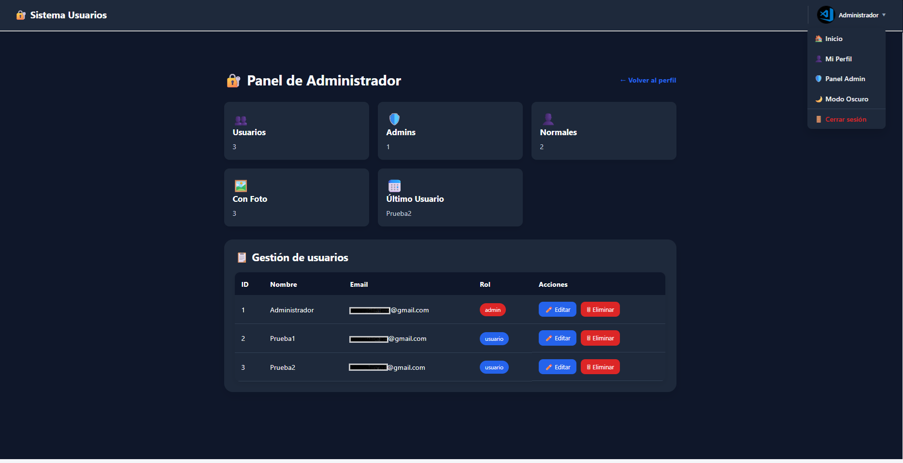
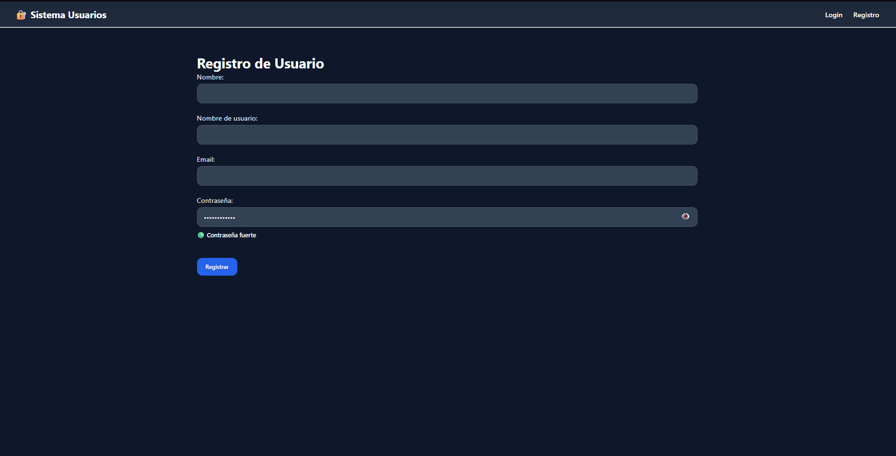
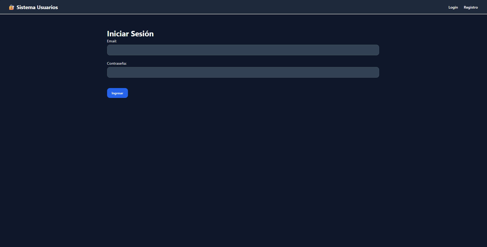

<div align="center">

# 🔐 Sistema de Usuarios Flask

### Sistema moderno de autenticación y administración de usuarios desarrollado con Flask

<br>


<br>

> 🚀 **Primera versión estable (v1.0.0)**

Sistema web completo para la gestión de usuarios con autenticación, roles, perfiles, panel administrativo y funcionalidades dinámicas mediante AJAX.

</div>

---

## 📦 Información de la versión

| Información | Detalle |
|-------------|---------|
| **Versión** | **v1.0.0** |
| **Estado** | ✅ Primera versión estable |
| **Fecha de lanzamiento** | Julio 2026 |
| **Autor** | Dilan Steven Chirva Cárdenas |
| **Lenguaje principal** | Python |
| **Framework** | Flask |

---

## 📌 Descripción

Sistema de gestión de usuarios diseñado para simular una aplicación real de autenticación y administración.

Permite registrar usuarios, iniciar sesión, gestionar perfiles, cambiar contraseñas, controlar permisos mediante roles y administrar usuarios desde un panel exclusivo para administradores.

Este proyecto fue desarrollado con el objetivo de fortalecer habilidades en:

- Backend con Flask
- Bases de datos SQL
- Seguridad y autenticación
- Gestión de sesiones
- Control de acceso por roles
- Desarrollo Full Stack

---

## ✨ Características

Esta versión (**v1.0.0**) representa la primera versión estable del sistema e incluye todas las funcionalidades principales para la gestión de usuarios, autenticación y administración.

### 👤 Gestión de Usuarios

- Registro de usuarios
- Inicio de sesión
- Cierre de sesión
- Perfil de usuario
- Edición de perfil
- Nombre de usuario único
- Descripción personalizada
- Foto de perfil

### 🔐 Seguridad

- Contraseñas cifradas con Werkzeug
- Validación de correos electrónicos
- Validación de contraseñas seguras
- Cambio de contraseña
- Protección de rutas privadas
- Control de acceso por roles
- Manejo de sesiones

### 🖼️ Fotos de Perfil

- Subida de imágenes
- Recorte de imágenes con Cropper.js
- Validación de imágenes con Pillow
- Eliminación automática de la foto anterior

### 🛡️ Panel Administrador

- Dashboard administrativo
- Estadísticas de usuarios
- CRUD completo de usuarios
- Edición de información
- Eliminación de usuarios
- Gestión de roles
- Panel protegido para administradores

### 🎨 Interfaz

- Diseño moderno
- Navbar dinámica
- Menú desplegable de usuario
- Mostrar/Ocultar contraseña
- Indicador de fortaleza de contraseña
- Modo Oscuro (Dark Mode)
- Diseño responsive

---

## 🛠️ Tecnologías Utilizadas

### Backend

- Python
- Flask
- Flask-SQLAlchemy
- SQLite
- Werkzeug

### Frontend

- HTML5
- CSS3
- Jinja2
- JavaScript

### Librerías

- Cropper.js
- Pillow

---

## 📂 Estructura del Proyecto

```plaintext
SISTEMA-USUARIOS/
│
├── app.py
├── models.py
├── README.md
├── .gitignore
│
├── instance/
│   └── database.db
│
├── static/
│   ├── css/
│   │   └── style.css
│   │
│   └── uploads/
│
├── templates/
│   ├── base.html
│   ├── home.html
│   ├── login.html
│   ├── register.html
│   ├── perfil.html
│   ├── edit_profile.html
│   ├── cambiar_password.html
│   ├── admin.html
│   ├── edit_user.html
│   └── usuarios.html
│
└── .venv/
```

---

## ⚙️ Instalación

### 1. Clonar repositorio

```bash
git clone https://github.com/Dilanwos/Sistema-usuarios.git
cd Sistema-usuarios
```

### 2. Crear entorno virtual

```bash
python -m venv venv
```

### 3. Activar entorno virtual

Windows:

```bash
venv\Scripts\activate
```

Linux / Mac:

```bash
source venv/bin/activate
```

### 4. Instalar dependencias

```bash
pip install -r requirements.txt
```

### 5. Ejecutar aplicación

```bash
python app.py
```

---

## 🔑 Sistema de Roles

### Usuario

- Acceso al perfil
- Edición de información personal
- Cambio de contraseña
- Gestión de foto de perfil

### Administrador

- Acceso al panel administrativo
- Gestión completa de usuarios
- Modificación de roles
- Estadísticas del sistema

---

## 🔒 Seguridad Implementada

- Hash de contraseñas
- Validación de contraseñas robustas
- Protección de rutas privadas
- Control de sesiones
- Restricción por roles
- Validación de correos electrónicos
- Validación de imágenes

---

## 📈 Funcionalidades Implementadas

- [x] Registro de usuarios
- [x] Inicio de sesión
- [x] Cierre de sesión
- [x] Perfil de usuario
- [x] Edición de perfil
- [x] Fotos de perfil
- [x] Cropper.js
- [x] Cambio de contraseña
- [x] Validación de contraseñas
- [x] Dashboard administrador
- [x] CRUD de usuarios
- [x] Sistema de roles
- [x] Navbar moderna
- [x] Menú desplegable
- [x] Dark Mode
- [x] Indicador de fortaleza de contraseña

---

## 📸 Capturas de Pantalla

### 🏠 Página Principal



---

### 👤 Perfil de Usuario



---

### 🛡️ Panel de Administración



---

### 🌙 Modo Oscuro



---

### 🔐 Registro



---

### 🔐 Inicio de Sesión



## 🚀 Mejoras Futuras

- Recuperación de contraseña por correo
- Dashboard con gráficas
- API REST
- Docker
- Sistema de notificaciones
- Registro de actividad (Logs)
- Autenticación en dos pasos (2FA)
- Deploy en Render

---

## 👨‍💻 Autor

**Dilanwos**

Proyecto educativo desarrollado con Flask para fortalecer conocimientos en desarrollo backend, seguridad, bases de datos y gestión de usuarios.
